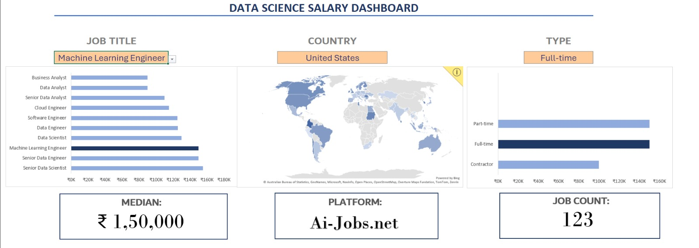
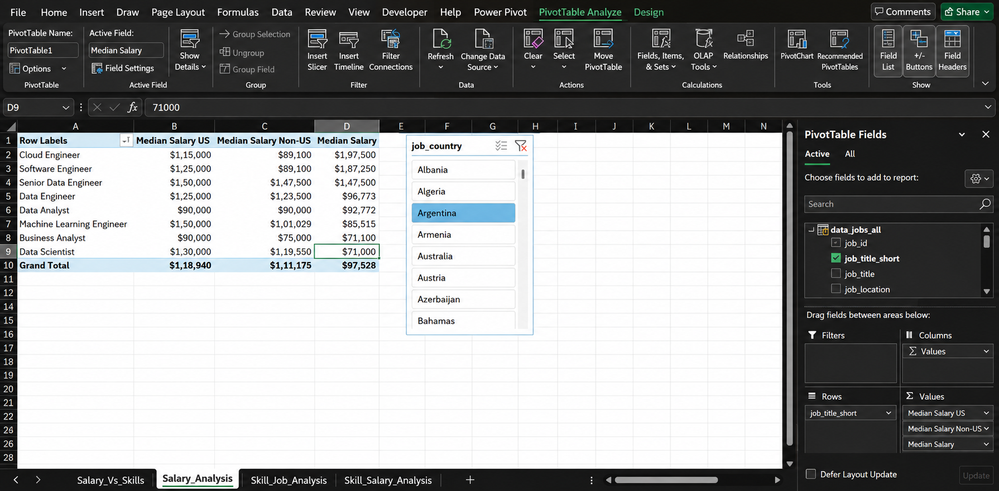
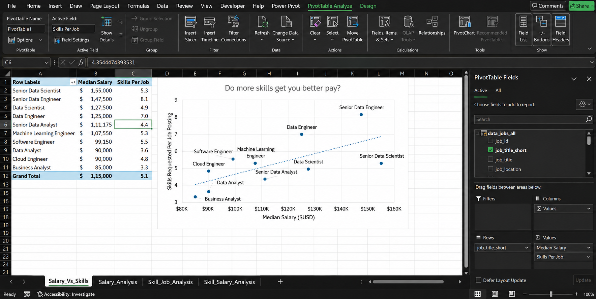
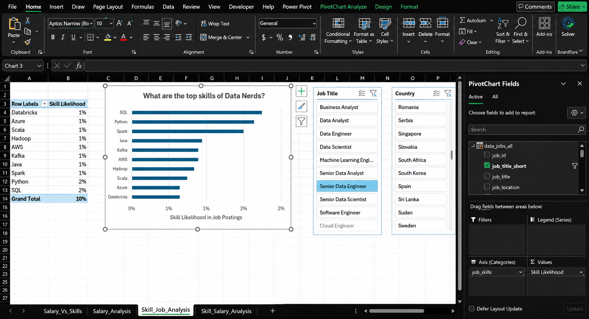
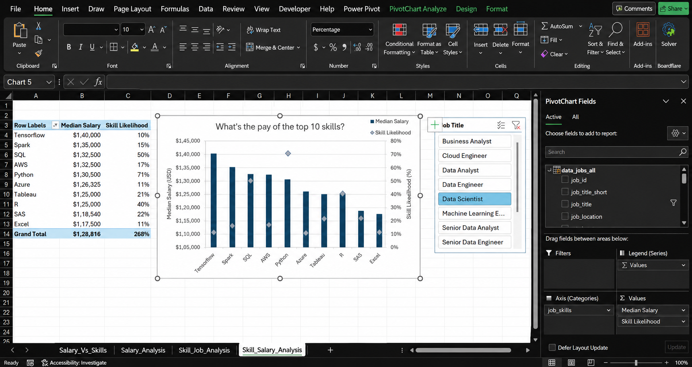

# 📊 Data Science Salary Dashboard

An interactive **Microsoft Excel dashboard** built to explore the data science job market through salaries, skills, job roles, countries, employment types, and job platforms.

This project is part of my journey into **Data Analytics**, where I am learning to turn raw data into meaningful insights and practical dashboards.

---

## 📸 Dashboard Preview



---

## 🎯 Project Objective

The goal of this project is to explore the data science job market and understand:

- 💰 How salaries vary across different job roles
- 🌎 How salaries differ across countries
- 💼 Which job types have more opportunities
- 🛠️ Which skills are associated with higher salaries
- 📈 The relationship between skills and job demand
- 🔎 Which platforms have the most job listings

The final result is an interactive dashboard where users can select different filters and explore the data dynamically.

---

## 🔄 Project Pipeline

```text
Raw Job Data
      ↓
Data Preparation
      ↓
Data Validation
      ↓
Salary Analysis
      ↓
Skill Analysis
      ↓
Job & Skill Analysis
      ↓
Visualization
      ↓
Interactive Dashboard
```

---

# 📊 Analysis

## 💰 Salary Analysis

The `Salary_Analysis` sheet explores salary differences across different data science job roles.



---

## 📈 Salary vs Skills

The `Salary_Vs_Skills` sheet explores the relationship between skills and salary levels.



---

## 🔎 Skill & Job Analysis

The `Skill_Job_Analysis` sheet explores the relationship between specific skills and job opportunities.



---

## 💵 Skill & Salary Analysis

The `Skill_Salary_Analysis` sheet explores how different skills relate to salary levels.



---

# 🛠️ Tools & Skills Used

### Microsoft Excel

- Excel Tables
- Structured References
- Data Validation
- Named Ranges
- Dynamic Array Functions
- `FILTER`
- `UNIQUE`
- `SORT`
- `MEDIAN`
- `COUNT`
- `COUNTIFS`
- `IF`
- `SEARCH`
- `ISNUMBER`
- Logical Conditions
- Data Analysis
- Data Visualization
- Dashboard Design

---

# 📂 Workbook Structure

| Sheet | Purpose |
|---|---|
| `Salary_Dashboard` | Interactive salary dashboard |
| `Salary_Analysis` | Salary analysis |
| `Salary_Vs_Skills` | Salary and skills analysis |
| `Skill_Job_Analysis` | Skills and job demand analysis |
| `Skill_Salary_Analysis` | Skills and salary analysis |
| `Data Validation` | Supporting lists and validation |
| `Jobs` | Job-related calculations |
| `Country` | Country-level analysis |
| `Type` | Employment-type analysis |
| `Platform` | Job-platform analysis |
| `Data` | Source data |

---

# 🧠 What I Learned

This project helped me move from simply learning individual Excel functions to **thinking more like a data analyst**.

Throughout the project, I practiced:

- Working with real-world datasets
- Cleaning and organizing data
- Creating dynamic analysis tables
- Using formulas with multiple conditions
- Building interactive dropdowns
- Calculating salary statistics
- Analyzing skills and job demand
- Creating data visualizations
- Designing an interactive dashboard
- Organizing an analytics project
- Using Git and GitHub to document and share my work

Most importantly, I learned how different Excel concepts can work together to create a complete **data analytics workflow**.

---

# 💡 Key Takeaways

Through the analysis, I explored how:

- Different data science roles have different salary levels
- Salary varies considerably across countries
- Employment types influence the number of opportunities
- Certain skills are associated with higher salaries
- Skills can also influence job demand
- Job platforms differ in the number of opportunities they provide

The dashboard makes these comparisons easier to explore through interactive filtering.

---

# 🌱 Future Improvements

Some improvements I would like to explore in future versions:

- Add more interactive dashboard filters
- Analyze experience levels
- Explore salary distributions
- Add time-based salary trends
- Automate more of the data preparation process
- Add more detailed skill-level insights
- Improve dashboard interactivity and design

---

# 🙏 Acknowledgements

A special thank you to **Luke Barousse**, whose YouTube content has been a major part of my learning journey in Data Analytics.

His practical, project-based approach helped me understand how to apply what I learn to real-world data projects instead of only learning concepts individually.

This project is one of the steps in that journey, and I am grateful for the knowledge and inspiration his content has provided .
You can find his courses in here https://www.youtube.com/@LukeBarousse .

---

# 🚀 About This Project

This project represents one step in my journey toward becoming a **Data Analyst**.

I wanted to take what I learned in Excel and turn it into something practical — from working with raw data and performing analysis to creating visualizations and building an interactive dashboard.

It has been a great learning experience, and there is definitely more to come. 🚀

---

### 👩‍💻 Built With

**Microsoft Excel • Data Analytics • Data Visualization • GitHub**
